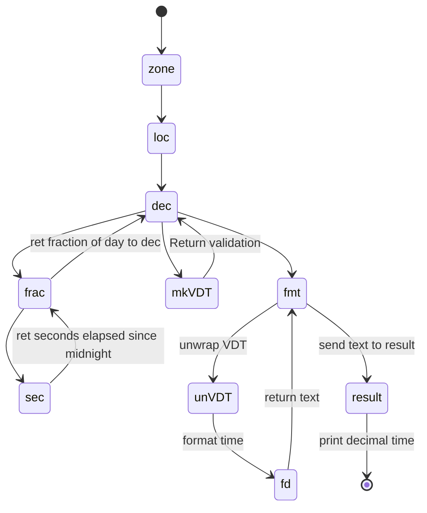

```mermaid

stateDiagram-v2
    [*] --> zone
    zone --> loc
    loc --> dec
    dec --> frac
    frac --> sec
    sec --> frac: ret seconds elapsed since midnight
    frac --> dec: ret fraction of day to dec
    dec --> mkVDT
    mkVDT --> dec: Return validation
    dec --> fmt
    fmt --> unVDT: unwrap VDT
    unVDT --> fd: format time
    fd --> fmt: return text
    fmt --> result: send text to result
    result --> [*]: print decimal time
```